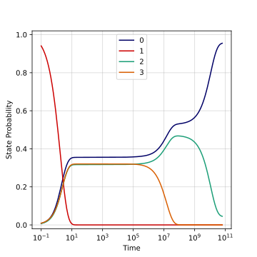
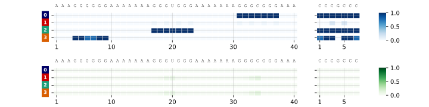
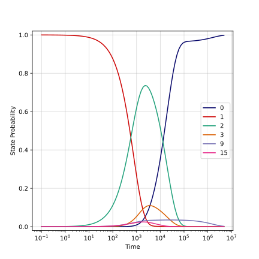
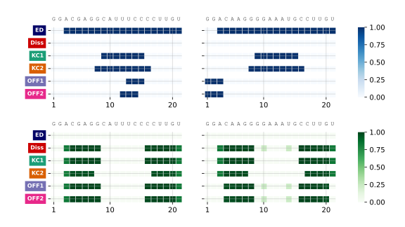
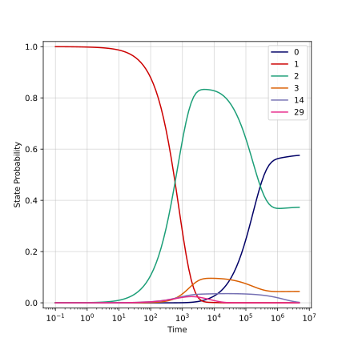
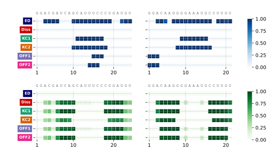
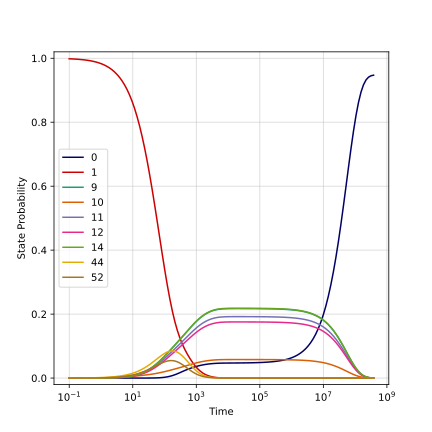
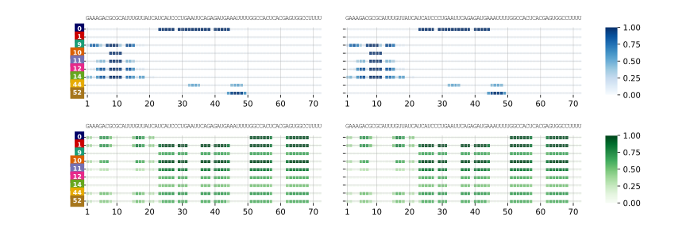
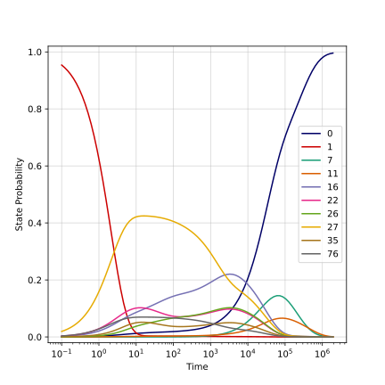
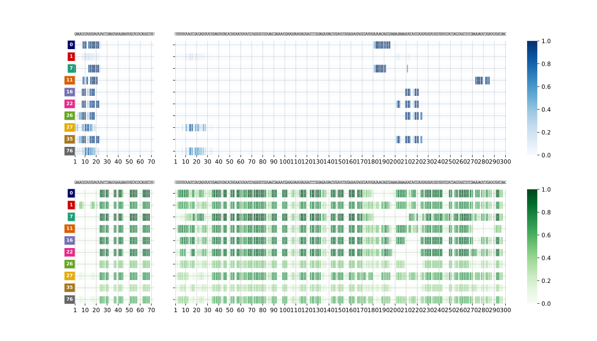

# Examples of RRI kinetics

This directory contains a set of biologically motivated example runs for
RIKin, alongside the scripts used to reproduce them and the plots shown in
the top-level [`README.md`](../README.md).

## Contents

* **FASTA files** — input sequences for each example (`exampleA.fasta`,
  `exampleB.fasta`, `HP1.fasta`, `HP2.fasta`, `HP3.fasta`, `MicA.fasta`,
  `OmpA.fasta`).
* **Config files** (`*.cfg`) — per-example JSON overrides, deep-merged on
  top of `rikin_pipeline.cfg` (see the main README's
  [Configuration file](../README.md#configuration-file) section for the
  schema).
* **`run-all.sh`** — runs `rikin_pipeline.py` for every example below, in
  one go.
* **`plot_kinetics.py`** — a [Jupytext](https://jupytext.readthedocs.io/)
  notebook (light-format `.py`, pairs with a `.ipynb`) that loads each
  example's results with `rikinplotlib.RikinRun` and regenerates the
  figures used throughout this repository.
* **`Plots/`** — the figures (SVG + PDF) produced by `plot_kinetics.py`,
  including the ones embedded in the top-level README.

## Examples

### Toy example

A short synthetic RNA pair, used as the minimal illustrative example in the
main README (see the [Quick example](../README.md#quick-example) section
there):
```bash
rikin_pipeline.py -o example --seqA AAAGGGGGGAAAAAAAGGGUGGGAAAAAAAGGGCGGGAAA --seqB CCCGCCC
```
or equivalently, from the FASTA files in this directory:
```bash
rikin_pipeline.py -o example --fastaA exampleA.fasta --fastaB exampleB.fasta
```

| Kinetics | Top states |
|---|---|
|  |  |

### Kissing-hairpin (KHP) system

Two designed hairpins that interact via a "kissing" loop–loop interaction,
run against two different partner hairpins:

```bash
rikin_pipeline.py --fastaA HP1.fasta --fastaB HP2.fasta -c khp.cfg -o HP1-HP2
rikin_pipeline.py --fastaA HP3.fasta --fastaB HP2.fasta -c khp.cfg -o HP3-HP2
```

| HP1:HP2 kinetics | HP1:HP2 states |
|---|---|
|  |  |

| HP3:HP2 kinetics | HP3:HP2 states |
|---|---|
|  |  |

### MicA–MicA homodimer

*E. coli* MicA is a small regulatory sRNA; here its self-interaction
(homodimerization) is analyzed:
```bash
rikin_pipeline.py --fastaA MicA.fasta --fastaB MicA.fasta -c MicA-MicA.cfg -o MicA-MicA
```

| MicA-MicA kinetics | MicA-MicA states |
|---|---|
|  |  |

### MicA–OmpA heterodimer

MicA's biological target: the 5′UTR of the *ompA* mRNA (translation of
which MicA represses upon binding):
```bash
rikin_pipeline.py --fastaA MicA.fasta --fastaB OmpA.fasta -c MicA-ompA.cfg -o MicA-OmpA
```

| MicA-OmpA kinetics | MicA-OmpA states |
|---|---|
|  |  |

## Reproducing everything

`run-all.sh` runs all of the above in sequence:
```bash
bash run-all.sh
```

## Regenerating the plots

Once the runs above have produced their output directories, `plot_kinetics.py`
loads each one and renders the full set of figures (state-probability
kinetics, top-state structures, interaction dotplots, and per-nucleotide
paired-probability kinetics) into `Plots/`.

Open `plot_kinetics.ipynb` directly in Jupyter/JupyterLab and run it:
```bash
jupyter notebook plot_kinetics.ipynb
```
It's paired with `plot_kinetics.py` via [Jupytext](https://jupytext.readthedocs.io/)
(light format), so the two stay in sync if you prefer editing the `.py`
version in a plain text editor or IDE.
