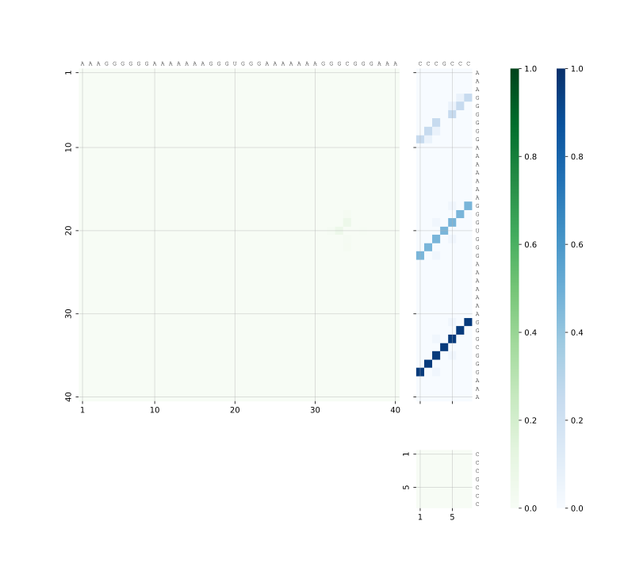
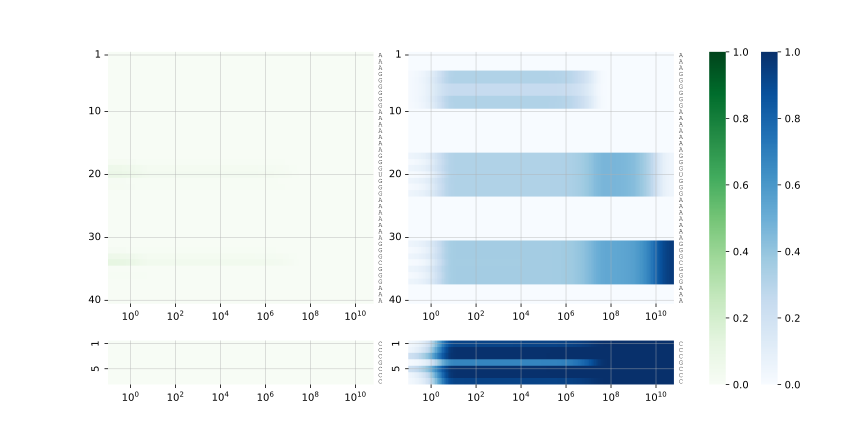

# RNAInterKin (RIKin)

RNAInterKin (RIKin) computes the **kinetics of RNA–RNA interaction** — how
two RNAs find and settle into their interaction structure over time — using
a detailed RNAup/IntaRNA-inspired interaction model built on RNA secondary
structure and the full Turner nearest-neighbor energy model.

Where most RNA–RNA interaction tools predict a single, most likely
interaction structure, RIKin instead predicts how the *population* of
possible interaction states evolves over time: which states form first,
which are transient, and which the system ultimately settles into.


*Predicted probabilities of the most prominent interaction states over time,
for a small toy example (see [Quick example](#quick-example) below).*


## Table of contents

- [Background](#background)
- [Installation](#installation)
  - [From the Bioconda package](#installation-from-the-conda-package)
  - [From source](#compilationinstallation-from-the-source-repository)
- [Quick example](#quick-example)
- [Usage](#usage)
  - [Pipeline stages](#pipeline-stages)
  - [Configuration file](#configuration-file)
  - [Command-line tools](#command-line-tools)
- [Output directory layout](#output-directory-layout)
- [More examples](#more-examples)
- [License](#license)
- [Authors and contacts](#authors-and-contacts)


## Background

Predicting RNA kinetics is computationally challenging on its own; the
dynamics of RNA–RNA *interaction* are substantially more demanding still,
due to the huge space of possible joint conformations. RIKin tackles this
with a series of measures:

* RNA interactions are studied at the level of secondary structure, with
  elementary step conformational changes (transitions) between states.
* Secondary structure interaction states are abstracted as RNAup/IntaRNA-like
  states, each representing an ensemble of interactions. The induced
  transitions between these states are computed directly by efficient
  algorithms.
* Sparsification techniques and constraints restrict the size of the
  computational problem in controlled ways.
* The energy landscape of these states is coarse-grained in two steps: a
  fast discrete coarse-graining, followed by a novel continuous
  coarse-graining.
* The resulting Master Equation of the Markov process is solved by matrix
  exponentiation, using the Padé method.

RIKin implements this as a pipeline of C++ tools (state enumeration,
coarse-graining), an Octave routine (solving the Master Equation), and
Python tooling (pipeline orchestration and plotting), tied together by a
single driver script, `rikin_pipeline.py`.


## Installation

### Installation from the Conda package

We recommend installing RNAInterKin from the `rikin` Bioconda package.

Create and activate a dedicated environment first:
```bash
conda create -n rikin
conda activate rikin
```

Then install:
```bash
conda install -c bioconda -c conda-forge rikin
```

This pulls in all runtime dependencies automatically — including
[ViennaRNA](https://www.tbi.univie.ac.at/RNA/), [LocARNA](http://www.bioinf.uni-freiburg.de/Software/LocARNA/),
Octave, and the Python scientific stack (NumPy, pandas, SciPy, Matplotlib,
seaborn) used by the plotting stage.

### Compilation/installation from the source repository

The tools can also be compiled and installed after cloning the source
repository. This requires a build toolchain with a C++ compiler and
autotools. We describe installation into a Conda environment, pulling the
ViennaRNA/LocARNA dependencies from Bioconda:

```bash
git clone https://github.com/s-will/rikin.git
cd rikin

conda create -n rikin -c bioconda -c conda-forge viennarna locarna \
    autoconf automake libtool pkg-config gengetopt \
    python numpy pandas scipy matplotlib seaborn octave

conda activate rikin

autoreconf -i
./configure --prefix=$CONDA_PREFIX PKG_CONFIG_PATH=$CONDA_PREFIX/lib/pkgconfig
make
make install
```


## Quick example

`rikin_pipeline.py` runs the complete pipeline — enumeration, coarse-graining,
solving the Master Equation, and plotting — for a pair of RNA sequences:

```bash
rikin_pipeline.py -o example --seqA AAAGGGGGGAAAAAAAGGGUGGGAAAAAAAGGGCGGGAAA --seqB CCCGCCC
```

Results, including the plots below, are written to the `example/` output
directory.

| | |
|---|---|
|  |  |
| Predicted state probabilities over time | Structures of the most prominent states |
|  |  |
| Base pair probability dotplot | Per-nucleotide pairing probabilities over time |

Equivalently, sequences can be given via FASTA files instead of directly on
the command line:
```bash
rikin_pipeline.py -o example --fastaA Examples/exampleA.fasta --fastaB Examples/exampleB.fasta
```

See [More examples](#more-examples) below for further, biologically
motivated examples (with a real bacterial sRNA–mRNA pair) and how to
reproduce all figures shown here.


## Usage

### Pipeline stages

`rikin_pipeline.py` coordinates the following stages, in order:

| Stage                        | Tool               | What it does |
|-------------------------------|---------------------|---------------|
| 1. State enumeration + sort   | `rikin_enum`        | Enumerates candidate interaction/structure states for the two input sequences |
| 2. Discrete coarse-graining   | `rikin_barriers`    | Groups states into basins and computes the transitions between them |
| 3. Continuous coarse-graining | `rikin_prune`       | Further prunes/merges the basin graph, and computes partition functions and rates |
| 4. Solve Master Equation      | `rikin_xrates.m` (Octave) | Solves the resulting Master Equation via Padé matrix exponentiation, giving state probabilities over time |
| 5. Plotting                   | `rikin_plot.py`     | Renders the full set of kinetics plots from the run's result files |

`rikin_pipeline.py` is a convenience wrapper that runs these in sequence,
with consistent file naming and the ability to skip stages whose output
already exists.

Useful `rikin_pipeline.py` options (`rikin_pipeline.py --help` for the
complete, current list):

* `-o, --outdir DIR` — output directory
* `--seqA SEQ`, `--seqB SEQ` — the two sequences, given directly
* `--fastaA FILE`, `--fastaB FILE` — the two sequences, given as FASTA files
  (mutually exclusive with `--seqA`/`--seqB` for the corresponding sequence)
* `-c, --config FILE` — JSON file deep-merged on top of the global config (see below)
* `--reuse` — skip stages whose output files already exist in `outdir`, to
  resume an interrupted run or re-plot without recomputing
* `--dryrun` — print the commands that would be run, without executing them
* `--bindir DIR` — look for the `rikin_*` tools in `DIR` instead of next to
  the script
* `--global-config FILE` — override the default global config
  (`rikin_pipeline.cfg` next to the script)

### Configuration file

Pipeline parameters live in a JSON config file. On startup,
`rikin_pipeline.py` loads `rikin_pipeline.cfg` from next to itself (override
with `--global-config`), and optionally deep-merges a run-specific file
passed via `-c/--config` on top of it. The schema:

```json
{
  "association_prefactor": 1.0,

  "common_opts": ["--verbose", "--max-hyb-length-diff", "8"],

  "enum_opts": ["--max-hyb-energy", "7", "--max-total-energy", "12"],

  "barriers_opts": [],

  "prune_opts": ["--min-rate", "5e-8", "--num-out", "800", "--num-pequ", "800"],

  "xrates_opts": ["--t8", "1e15"],

  "plot_opts": {
    "shown_state_threshold": 0.02,
    "formats": ["svg", "pdf"],
    "plots": ["all"],
    "config": null,
    "output_dir": null
  }
}
```

* `common_opts` are passed to both `rikin_enum` and `rikin_barriers`.
* `enum_opts`, `barriers_opts`, `xrates_opts` are passed to the
  correspondingly named stage only.
* `prune_opts` are passed to `rikin_prune`, alongside
  `--preexpf-first <association_prefactor>`.
* `plot_opts` configures the final plotting stage.

Only the keys you want to override need to be present in a run-specific
`-c/--config` file — everything else falls back to `rikin_pipeline.cfg`.
See [Examples](#more-examples) for several such override files in practice.

### Command-line tools

Each stage's underlying tool can also be run standalone, e.g. for debugging
or custom workflows. We only give a brief description here; run any tool
with `--help` for the full, current option list, or see its source option
definition (`.ggo` file) linked below for the same information.

| Tool | Purpose | Full option reference |
|------|---------|------------------------|
| `rikin_enum` | Enumerate candidate interaction/structure states for the two input RNAs | `rikin_enum --help` / [`rikin_enum.ggo`](src/rikin_enum.ggo) |
| `rikin_barriers` | Construct the discretely coarse-grained basin/state system | `rikin_barriers --help` / [`rikin_barriers.ggo`](src/rikin_barriers.ggo) |
| `rikin_prune` | Prune/continuously coarse-grain the state system and compute rates | `rikin_prune --help` / [`rikin_prune.ggo`](src/rikin_prune.ggo) |
| `rikin_xrates.m` | Solve the Master Equation (Octave; run via `octave rikin_xrates.m ...`) | `octave rikin_xrates.m --help` |
| `rikin_plot.py` | Render kinetics plots from a completed run's result files | `rikin_plot.py --help` |


## Output directory layout

A completed run's `outdir` contains, among others:

| File                        | Contents |
|------------------------------|----------|
| `sorted_states.gz`           | Enumerated, sorted candidate states |
| `bg`                         | Basin graph after discrete coarse-graining |
| `barriers_track.gz`, `track-ipps-barriers.gz` | Barrier-stage tracking data |
| `pf`, `bar`, `rates.gz`      | Partition functions, basins, and rates after pruning |
| `kin`                        | Solved kinetics (final result of the computation, state probabilities over time) |
| `*.svg`, `*.pdf`             | Plots of the RNA-RNA kinetics |

These are intermediate/result files consumed by later pipeline stages; the
plots produced by the final stage are the primary human-readable output.


## More examples

The [`Examples`](Examples/Examples.md) directory contains several further,
biologically motivated examples — including a real bacterial sRNA–mRNA pair
(*E. coli* MicA sRNA and the *ompA* mRNA 5′UTR) and a designed
kissing-hairpin (KHP) system — along with a script to reproduce all of them
and a notebook that regenerates the figures shown throughout this README.
See [`Examples/README.md`](Examples/Examples.md) for details.


## License

RNAInterKin is distributed under the GNU Affero General Public License
v3.0 or later (AGPL-3.0-or-later). See [`COPYING`](COPYING) for the full
license text.


## Authors and contacts

* Rolf Backofen, University of Freiburg
* Sebastian Will, École Polytechnique
