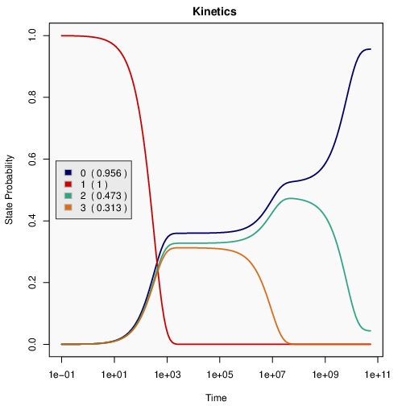

# RIkin

Rikin implements tools for the fast computation of RNA-RNA interaction kinetics
in a detailed RNAup/Intarna-inspired interaction model.

It features accurate modeling of RNA structures and interaction complexes based on their secondary structure and the full Turner nearest neighbor energy model.


## Example

Our methods studies the dynamics of the interaction of two RNAs, given as
sequences, e.g.
```
AAAGGGGGGAAAAAAAGGGUGGGAAAAAAAGGGCGGGAAA
```
and
```
CCCGCCC
```

Figure: Kinetics of RNAs can be analyzed and visualized in many ways. The
most direct result of the analysis are predicted probabilities over time of
single interaction states. These probability progressions can be visualized
for the most prominent states.



## Methods

The prediction of RNA kinetics is computationally challenging, and
the dynamics of RNA-RNA interaction is even substantially more demanding,
due to the huge space of possible conformations.

Rikin takes a series of measures to tackle the computational
problems:

* RNA interactions are studied at the level of secondary structure with
  elementary step conformation changes (transitions).

* Secondary structure interaction states are abstracted as RNAup/Intarna
  like states that each represent an ensemble of interactions. The induced
  transitions between these states are directly computed by efficient
  algorithms. 

* Sparsification techniques and constraints are applied to
  further restrict the size of the computational problem in controlled ways.

* The energy landscape of these states is further coarse-grained in two
  steps: a fast discrete coarse graining is followed by a novel continuous
  coarse-graining.

* The Master Equation of the corresponding Markov process is solved by the
  matrix exponentiation method of Padé.


## Installation

### Installation from Conda package

We recommend to install from the conda package of rikin, using mamba.

Possible create and activate an environment for rikin first:
```
conda create rikin
conda activate rikin
```

Then, install by

```
mamba install -c bioconda rikin
```

or alternatively conda

```
conda install -c bioconda rikin
```

Then, activate the environment 

```
conda activate rikin
```

and install required R pacakges

```
Rscript -e "install.packages(c('argparse','shape','RColorBrewer'))"
```


### Compilation/installation from the source repository

The tools can be compiled and installed after cloning the source repository. This requires a build toolchain with C++ compiler and autotools. We describe the installation in a conda environment (and get further specific dependencies from bioconda).

```
mamba create -n rikin -c bioconda -c conda-forge viennarna locarna r-base

conda activate rikin

autoreconf -i
./configure --prefix=$CONDA_PREFIX PKG_CONFIG_PATH=$CONDA_PREFIX/lib/pkgconfig
make
make install

```

Finally, see above (installation from conda package) how to install the required R packages.


## Usage

RIkin computes kinetics of RNA-RNA interaction in several stages. The
complete pipeline consists of the stages

* state enumeration (rikin_enumerate)
* sorting of states (sort)
* first coarse graining (rikin_barriers)
* second coarse graining (rikin_prune)
* solving of the master equation (rikin_xrates.m)
* plotting (rikin_kinetics.R)

We provide the script rikin_pipeline.sh to perform all these pipeline
stages in coordination for a pair of given RNAs. 

For example
```
rikin_pipeline.sh -j example \
CGGAGCGACGCUACGUACGGAGCUAGCUGAAACGUAGCAGAGCUAGCUGAAACGUAGCAGAGCUAGCUGAAACGUAGCAGACAGAUACUAGUUUCAAAACUUCCUUGACAGAACCAUUUCAUGUUCAAUAAUGAAAAUUACUUUCACAUGUUUUAGUGGAAAACGUACGUACGUAUCGUAGCGGUUGGACUUACGUAUAC \
GCUGCGAUGCAUGCCUCGAU \
| tee example.out
```
predicts the kinetics of the interaction between the two given
sequences using a set of default parameters. The results are written to
subdirectory example and text output is redirected to example.out.
In particular, we produce a plot of the dynamics of state probabities in example/example.pdf. This plot was already shown as example above.

All command line tools can be further configured and provide detailed help
with options --help or -h.


Related publications
--------------------

A manuscript describing RIkin is in preparation.


Authors and Contacts
--------------------

* Rolf Backofen, University of Freiburg

* Sebastian Will, École Polytechnique
